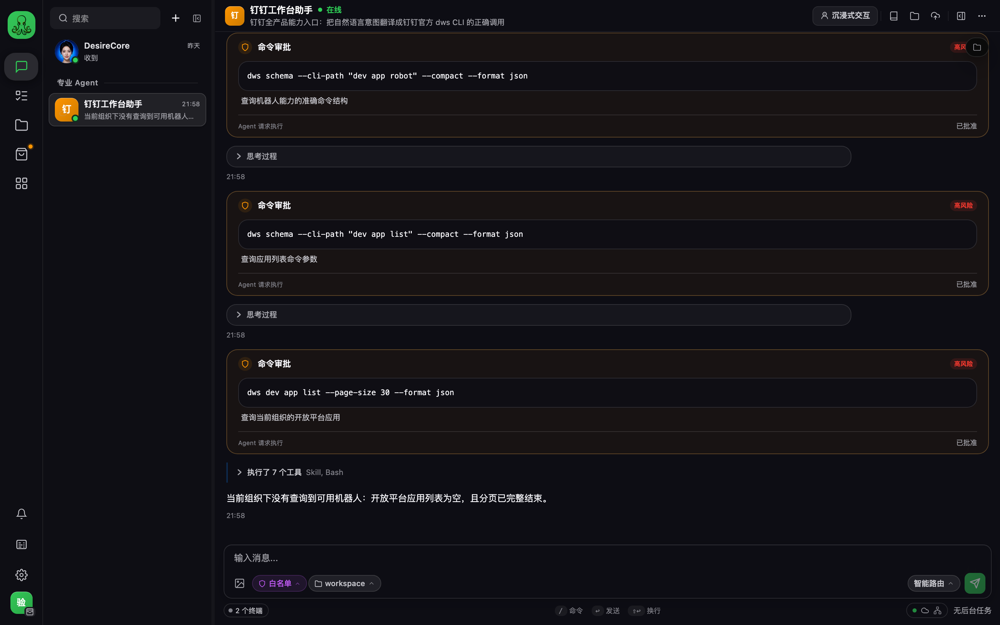
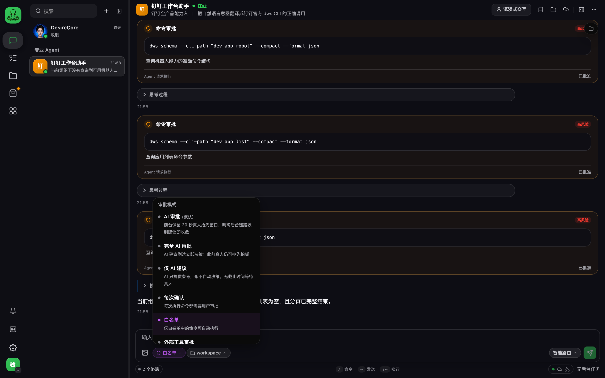

# 界面表现与审批闸门

用户问「为什么每条命令都要我点确认」「这个审批模式该选哪个」「怎么关掉」时读这篇。

---

## 一次真实对话长什么样

上图是问「我这边有哪些可用的机器人？」的完整过程。三件事值得注意：

1. **每条 `dws` 命令都过审批闸门**，标注风险等级，用户可以逐条批准或拒绝
2. **先查 schema 再执行** —— 前两条是 `dws schema --cli-path ...` 确认命令结构与参数，第三条才真正执行
3. **答案带着依据** —— 「开放平台应用列表为空，**且分页已完整结束**」。只有确认分页走到底才敢说「没有」，不会让用户被一个假的空结果误导

---

## 为什么每条命令都触发审批

实测每条 `dws` 命令都会被判**高风险**并弹审批卡片——18 个测试用例里 34 次 Bash 调用触发了 **41 次审批**。这不是配置错误，是默认行为。

出路是把 `dws` 加进命令白名单，而不是降低风险判定。

---

## 六种审批模式

点输入框左下角的审批模式胶囊即可切换：

| 模式 | 行为 | 适合 |
| --- | --- | --- |
| **AI 审批**（默认） | 前台保留 30 秒真人抢先窗口，AI 建议到达即收敛 | 日常，但**需要配好审批 chat 模型** |
| 完全 AI 审批 | AI 建议到达立即决策 | 无人值守 |
| 仅 AI 建议 | AI 只提供参考，永不自动决策，**无截止时间等待真人** | 高风险场景 |
| 每次确认 | 每次执行命令都要用户审批 | 最保守 |
| **白名单** | 仅白名单中的命令可自动执行 | **推荐**：把 `dws` 加进去 |
| 外部工具审批 | 交给外部系统裁决 | 有审批中台时 |

---

## 最常见的踩坑：默认模式需要审批模型

**默认的「AI 审批」需要一个可用的审批 chat 模型。** 没配的话所有命令会被 fail-closed 拦掉，报「AI 审批后端不可用，命令未执行」——连助手自己写计划文件都会被拦。

两条出路：

- 去资源管理面板 → 算力，配一个 chat 模型
- 或换成「白名单」/「每次确认」

用户报「命令一直执行不了 / 一直说后端不可用」时，先问这一条。
