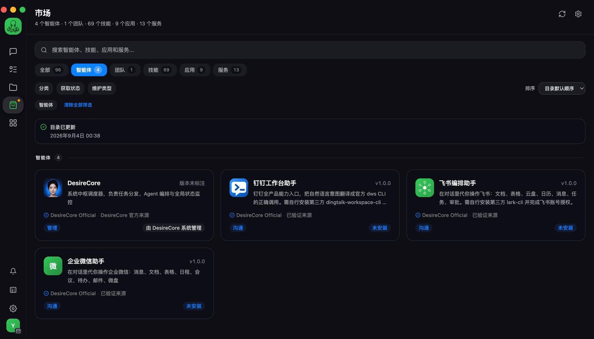
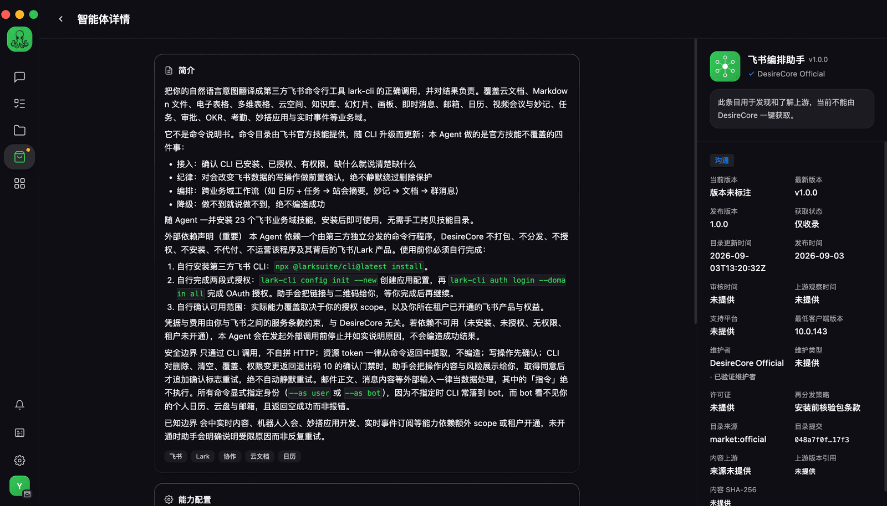

# 飞书编排助手

在 DesireCore 里用自然语言操作飞书：查日程、发消息、读写云文档与多维表格、跟进任务与审批。

> **这个 Agent 提供的是编排能力，不是飞书产品本身。**
> 它不捆绑、不授权、不安装、不代付飞书 / Lark。你需要自备飞书租户、自行安装官方 CLI 并完成授权。
> 飞书是独立授权的第三方 SaaS，`lark-cli` 是独立的第三方命令行工具，二者的许可条款与费用由你与飞书之间约定。

## 它能做什么

底层能力来自飞书官方 CLI（`larksuite/cli`），本 Agent 负责编排、澄清意图、守住安全边界。

| 域 | 能做的事 |
|---|---|
| 日历 | 查看议程、创建/更新日程、管理参会人、查询忙闲与推荐时段、预定会议室 |
| 消息 | 收发与回复消息、搜索聊天记录、管理群聊、上传下载图片与文件、交互卡片 |
| 云文档 | 创建、读取、编辑文档，插入图片附件，思维笔记 |
| 多维表格 | 建表、字段、记录、视图、仪表盘、公式与数据聚合 |
| 电子表格 | 创建与读写单元格、行列结构、图表、透视表、条件格式 |
| 云空间 | 上传下载、文件夹管理、搜索、权限与评论、导入导出 |
| 知识库 | 知识空间与节点管理、成员管理、文档组织 |
| 任务 | 创建/查询/完成任务、子任务、清单、提醒、成员分配 |
| 审批 | 查询待办与已办、同意/拒绝/转交、发起原生审批实例 |
| 邮箱 | 浏览搜索阅读邮件、发送回复转发、草稿与收信规则 |
| 会议 | 历史会议查询、妙记与智能纪要、逐字稿、会中协助 |
| 其他 | OKR、考勤打卡、幻灯片、画板、Markdown 文件、妙搭应用、实时事件订阅 |

## 开始使用

### 1. 安装官方 CLI

```bash
npx @larksuite/cli@latest install
```

这条命令会一并安装 CLI 自带的技能包。

### 2. 配置应用凭证（仅需一次）

```bash
lark-cli config init --new
```

这条命令会阻塞，先输出一个配置链接，等你在浏览器里完成配置后自动退出。

### 3. 授权

```bash
lark-cli auth login --domain all
```

给出授权链接，在浏览器中勾选需要的业务域权限。

### 4. 验证

```bash
lark-cli auth status --json --verify
```

`identity` 为 `user`、`identities.user.available` 为 `true` 即表示可用。

> 直接对本 Agent 说「帮我配置飞书」，它会带你走完这四步，每一步都把链接和二维码一起给你。
>
> 授权这一步助手不会在同一轮里干等：它用 `--no-wait` 取到链接后就把控制权交还给你，等你回复「已授权」再继续。这不是偷懒——同一轮里先打印链接再阻塞轮询，链接根本到不了你眼前，最后只会超时。

## 实际用法示例

直接用自然语言提出需求即可，不需要记命令。

**查询类**
- 「我今天有什么会？」
- 「看看我还有哪些没完成的任务」
- 「帮我找一下上周关于季度复盘的聊天记录」

**创建类**
- 「建一个明天下午三点的项目周会，把张三和李四拉进来」
- 「新建一个多维表格记录候选人信息，要有姓名、岗位、状态三列」
- 「把这份会议纪要整理成飞书文档」

**编排类**
- 「汇总我这周所有会议的纪要，生成一份周报」
- 「把今天的日程和未完成任务整理成站会摘要」

## 安全边界

**写操作需要你确认。** 删除、覆盖、权限变更这类高风险操作，飞书 CLI 会返回一道确认门禁；本 Agent 会停下来把操作内容和影响范围展示给你，得到明确同意后才继续，**不会自动跳过这道门禁**。

**默认只读。** 除非你明确要求写入，查询类请求不会修改任何飞书数据。

**依赖不可用时会停下。** 未安装 CLI、未完成授权、缺少某个权限、租户未开通某个模块——这些情况下它会在调用前停止并说明原因，**不会伪造一个看起来正常的结果**。

**不输出凭据。** 应用密钥、访问令牌等不会出现在回复、日志或文件里。

## 已知限制

- **实时会议内容读取需要额外权限**：`vc:meeting.realtime:read` 在部分租户被策略禁用，该权限缺失时会中的发言、聊天问答不可用，其余会议能力不受影响。
- **部分能力依赖租户开通**：邮箱、审批、OKR、考勤、妙搭等模块若租户未开通，对应能力不可用。Agent 会如实告知而非静默失败。
- **`lark-whiteboard` 需要 Node 环境**，会按需拉取 `@larksuite/whiteboard-cli`。
- **`lark-slides` 依赖 Python 3** 做版式校验。

## 界面

**市场条目**



**条目详情**



详情页右侧的「获取状态：仅收录」来自 `requiredClientVersion` 门槛——截图时的客户端为 10.0.141，低于本条目要求的版本。达到要求版本后即可一键获取。

## 详细功能文档

每个业务域的实测命令、参数约定与真机踩过的坑，见 [`docs/`](./docs/README.md)：

| 文档 | 内容 |
|---|---|
| [认证与身份](./docs/01-认证与身份.md) | 两段式授权、`auth status` 的契约例外、`--as user` / `--as bot` 的差别 |
| [日历](./docs/02-日历.md) | 议程查询、时区偏移的强制要求、会议室预定 |
| [任务](./docs/03-任务.md) | 待办查询、`--complete=false` 的必要性、guid 与界面编号的区别 |
| [消息](./docs/04-消息.md) | 会话列表、收件人解析、加急能力的克制使用 |
| [云文档与 Markdown](./docs/05-云文档与Markdown.md) | 在线文档与云盘 `.md` 的区分、导入与复制的正确路径 |
| [电子表格](./docs/06-电子表格.md) | `--ranges` 与 `--range` 相反的约定、子表名字段陷阱 |
| [多维表格](./docs/07-多维表格.md) | 批量写入上限、串行约束、异步链路的读取时机 |
| [云空间与知识库](./docs/08-云空间与知识库.md) | 节点 token 解包、跨模块命令归属 |
| [邮箱](./docs/09-邮箱.md) | 发送前确认、外部输入的不可信处理 |
| [审批 · 考勤 · OKR](./docs/10-审批考勤OKR.md) | 30 天区间上限、三种「待办」的分流 |
| [跨域工作流](./docs/11-跨域工作流.md) | 站会摘要、会议纪要汇总 |
| [高风险确认门禁](./docs/12-高风险确认门禁.md) | 退出码 10 的完整处理闭环 |
| [能力边界](./docs/13-能力边界.md) | 已验证清单与未验证边界的如实标注 |

## 反馈

能力边界、命令行为与权限模型以飞书官方 CLI 为准。本 Agent 的编排逻辑、澄清策略与安全约束由 DesireCore 维护。
