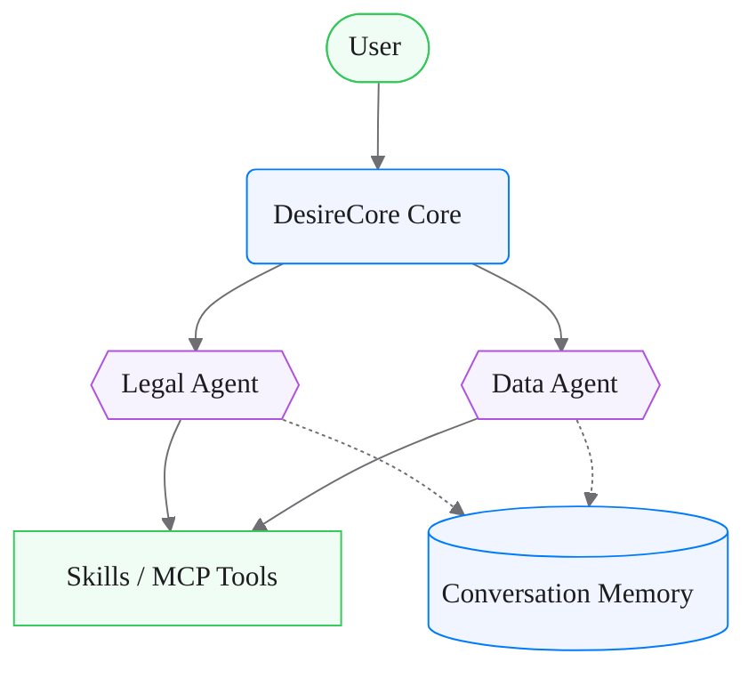
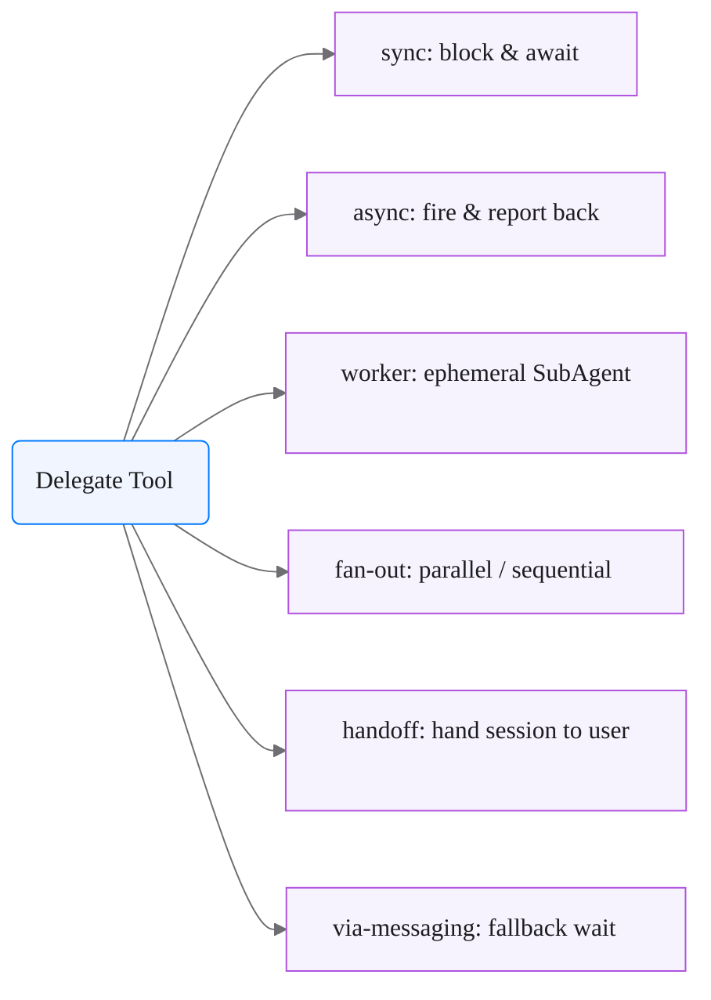
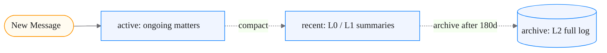
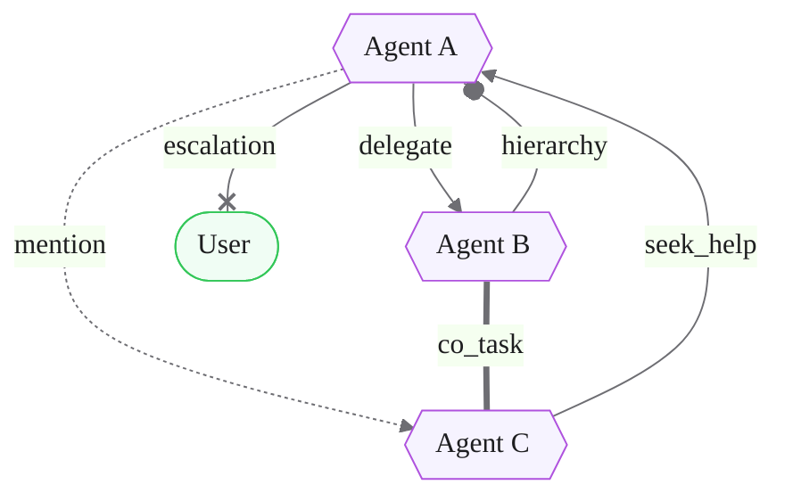
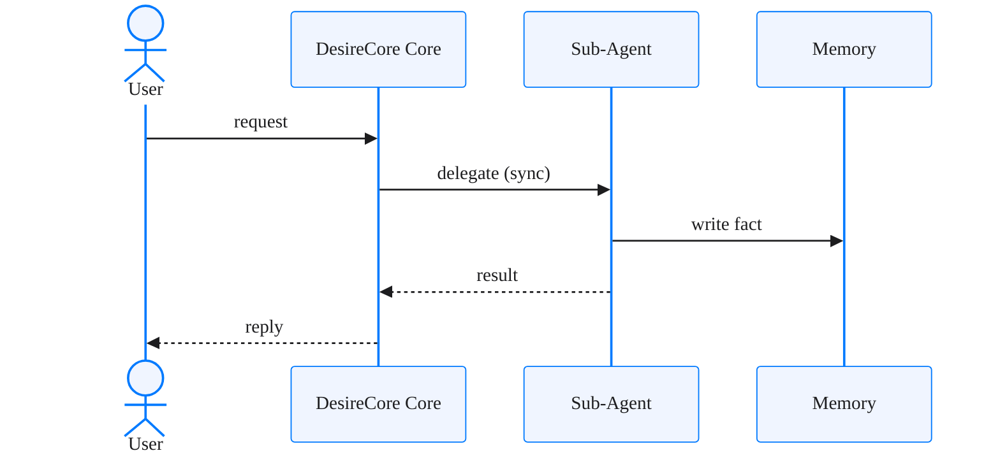

# Built-in Templates (内置模板)

Ready-to-use, brand-styled Mermaid for DesireCore's own architecture patterns.
Adapt the labels to the user's subject; keep the header and `classDef`s intact.
All four are verified to render.

## 1. Agent architecture (Agent 架构图)

Mirrors the delegate / skills / memory layout (`lib/agent-service/builtin-tools/delegate.ts`).

## 2. Delegate 6 modes (Delegate 六种模式)

The unified delegate tool and its six execution modes.

## 3. Three-tier conversation memory (三层对话记忆)

active → recent (L0/L1) → archive (L2); writes are dotted
(`lib/schemas/agent-service/conversation-memory.ts`).

## 4. Relation graph (关系图谱，6 种边)

The six edge types projected by `lib/agent-service/relations/projector.ts`, each
drawn with a distinct edge style. Edge weight decays over time (30-day half-life).

## Other diagram types

For sequence / state / ER / class diagrams, keep the same `%%{init}%%` header for
a consistent light theme. Example sequence diagram:

